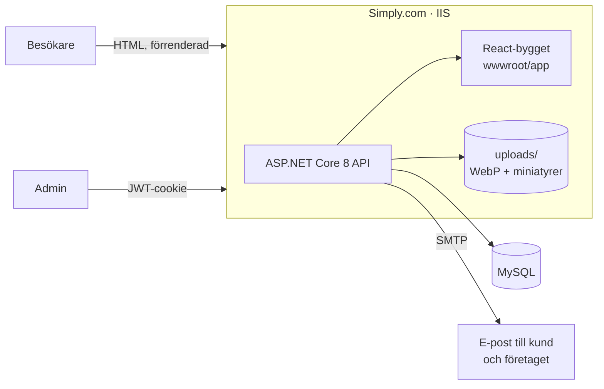

# Terrys Allbygg

[](https://github.com/zacki744/TerrysAllBygg/actions/workflows/ci.yml)

**[terrysallbygg.se](https://terrysallbygg.se)** — webbplats i produktion för ett lokalt bygg- och snickeriföretag på Österlen, Skåne. Besökare bläddrar bland tidigare byggprojekt, beställer färdiga snickerier och skickar konsultationsförfrågningar; företaget sköter innehållet själv i en egen adminpanel.

<!-- Skärmdumpar: lägg desktop- och mobilbild i docs/ och avkommentera
 
-->

## I korthet

- **Fullstack:** React 19 + TypeScript (Vite) mot ett ASP.NET Core 8-API med Dapper och MySQL
- **Säkerhet:** JWT i httpOnly-cookie, BCrypt, rate limiting per IP, säkerhetsheaders (CSP, HSTS), vitlistade tabellnamn, inbjudningsbaserade adminkonton
- **SEO:** förrenderade sidor vid build, dynamisk sitemap från databasen, strukturerad data (schema.org), läsbara URL:er
- **Bilder:** uppladdning direkt från mobilen (även HEIC), EXIF-rotation, WebP i två storlekar, GPS-data rensas
- **GDPR:** integritetspolicy byggd från det faktiska dataflödet, maskerade e-postadresser i loggar, ingen spårning eller cookiebanner
- **Tillgänglighet:** WCAG AA-kontrast, kopplade formuläretiketter, tangentbordsnavigering — kontrollerat med axe
- **Kvalitet:** Vitest + Testing Library i frontend, xUnit i backend, CI på varje push



---

## Innehåll

- [Om projektet](#om-projektet)
- [Funktioner](#funktioner)
- [Tech stack](#tech-stack)
- [Projektstruktur](#projektstruktur)
- [Kom igång](#kom-igång)
- [Miljövariabler](#miljövariabler)
- [Deployment](#deployment)
- [API-översikt](#api-översikt)
- [Admin-panel](#admin-panel)

---

## Om projektet

Terrys AllBygg erbjuder skräddarsydda byggprojekt (bastuer, tillbyggnader, altaner, förråd m.m.) samt ett sortiment av handgjorda snickerier — bänkar, lådor, skärbrädor, gungor och mer — med fasta priser. Sidan fungerar som digital skyltfönster och kontaktyta för nya kunder.

---

## Funktioner

### Publika sidor

| Sida | Beskrivning |
|---|---|
| **Hem** (`/`) | Hero, ett urval av projekt, tjänster och kontaktvägar |
| **Projekt** (`/projekt`) | Alla tidigare byggprojekt |
| **Projektdetalj** (`/projekt/<id>/<slug>`) | Bildgalleri och beskrivning |
| **Snickerier** (`/snickerier`) | Färdiga snickerier med pris och bild |
| **Snickeri-detalj** (`/snickerier/<id>/<slug>`) | Produktvy med bildgalleri och förfrågningsformulär |
| **Om oss** (`/about`) | Företagspresentation, tjänster och kontaktinfo |
| **Boka konsultation** (`/book`) | Formulär för kostnadsfri konsultation |
| **Integritetspolicy** (`/integritetspolicy`) | Hur personuppgifter från formulären hanteras |

Gamla adresser (`/projects?id=…`, `/snickeri?id=…`) omdirigeras till de nya.

### E-postflöden

- **Konsultationsförfrågan** — skickar bekräftelse till kunden + notifiering till Terry
- **Snickeri-förfrågan** — kunden anger namn, e-post och ev. önskemål; Terry meddelas med snickeriets titel och pris

### Admin-panel (`/admin`)

- Inloggning via JWT-cookie (httpOnly, Secure, SameSite=Strict)
- CRUD för projekt (titel, beskrivning, bilder)
- CRUD för snickerier (titel, beskrivning, pris, bilder)
- Bilduppladdning: WebP i 1600 px + miniatyr i 640 px (SkiaSharp, Magick.NET för HEIC)
- Bildunderhåll: krymper äldre bilder, skapar saknade miniatyrer och flyttar undan oanvända
- Användarhantering: bjud in nya admins via e-post, återställ lösenord, radera konton

---

## Tech stack

### Frontend
- **React 19** + **TypeScript** — komponentbaserat SPA
- **Vite 8** — byggsystem och dev-server
- **React Router 7** — client-side routing
- **React Helmet Async** — SEO-hantering per sida (title, meta, OG, JSON-LD)
- **CSS Modules** — scoped stilar med CSS-variabler (`--primary: #C86B3C`)
- **Lucide React** — ikoner

### Backend
- **.NET 8** (ASP.NET Core Web API)
- **Dapper** + **MySqlConnector** — tunn ORM mot MySQL
- **BCrypt.Net** — lösenordshashning
- **JWT Bearer** — autentisering via httpOnly-cookie
- **SkiaSharp** — bildresizing och JPEG-komprimering (max 1 600 px, kvalitet 82)
- **Magick.NET** — HEIC/HEIF-konvertering
- **Serilog** — strukturerad loggning till konsol och rullande loggfiler
- **ASP.NET Core Rate Limiting** — skydd mot spam och brute force

### Databas
- **MySQL** (hostad på Simply.com)

### Infrastruktur
- **Simply.com** — webbhotell och domän (`terrysallbygg.se`)
- **FTP-deployment** via `deploy.sh` + GitHub Actions
- React-bygget kopieras in i `TABB/API/wwwroot/app/` och servas statiskt av .NET-appen

---

## Projektstruktur

```
TerrysAllBygg/
├── frontend/                  # React + TypeScript (Vite)
│   ├── src/
│   │   ├── components/        # Navbar, Footer, Hero, kort, skelett, UI-primitiver
│   │   ├── pages/             # Publika sidor + admin-sidor
│   │   ├── hooks/             # useFetch
│   │   ├── lib/               # api, routes, schema, images, contact, privacy …
│   ├── scripts/prerender.mjs  # Förrenderar fasta sidor efter build
│   │   └── index.css          # Globala CSS-variabler och reset
│   ├── deploy-backend.sh      # Bygger och kopierar dist → wwwroot/app
│   └── vite.config.ts         # Dev-proxy → .NET på port 7026
│
└── TABB/                      # .NET 8 Solution
    ├── API/                   # ASP.NET Core Web API
    │   ├── Controllers/       # BookingController, ProjectsController, SnickeriController
    │   │   └── Admin/         # Auth, Projects, Snickeri, Image, UserManagement
    │   ├── Extensions/        # RateLimitingExtensions
    │   ├── Helpers/           # ImageProcessor, ImageMaintenance, ImageUploadHelper
    │   ├── Middleware/        # GlobalExceptionHandler, SecurityHeadersMiddleware
    │   ├── Program.cs         # App-konfiguration, middleware-pipeline
    │   └── wwwroot/app/       # Genererat (React-bygget)
    ├── Model/                 # DTOs och request-modeller
    ├── Tests/                 # xUnit
    └── Services/              # Tjänstlager
        └── Src/
            ├── Auth/          # AuthService, UserManagementService
            ├── DB/            # MySqlDatabase (generisk CRUD), IDbConnectionFactory
            ├── Mail/          # EmailService, SmtpEmailSender, EmailTemplate
            ├── Projects/      # ProjectsService
            └── Snickerier/    # SnickeriService
```

---

## Kom igång

### Förutsättningar

- [.NET 8 SDK](https://dotnet.microsoft.com/download)
- [Node.js 20+](https://nodejs.org)
- MySQL-databas (lokalt eller remote)

### Backend

```bash
cd TABB/API
# Konfigurera user secrets (se Miljövariabler nedan)
dotnet user-secrets set "Jwt:Key" "din-hemliga-nyckel"
# ...

dotnet run
# API kör på https://localhost:7026
```

### Frontend

```bash
cd frontend
npm install
npm run dev
# Dev-server på http://localhost:5173
# API-anrop proxas automatiskt till :7026
```

### Tester

```bash
cd frontend && npm test          # Vitest + Testing Library
cd TABB/Tests && dotnet test     # xUnit
```

Båda körs automatiskt i GitHub Actions vid varje push (`.github/workflows/ci.yml`), tillsammans med lint och build.

### Bygga och deployera frontend till backend

```bash
cd frontend
npm run deploy:backend
# Bygger React och kopierar dist → ../TABB/API/wwwroot/app
```

---

## Miljövariabler

Konfigureras via `appsettings.json` + .NET User Secrets (dev) eller miljövariabler (prod).

| Nyckel | Beskrivning |
|---|---|
| `Jwt:Key` | Hemlig signeringsnyckel för JWT |
| `Jwt:Issuer` | JWT-utfärdare |
| `Jwt:Audience` | JWT-publik |
| `Database:Host` | MySQL-serveradress |
| `Database:Port` | MySQL-port (standard 3306) |
| `Database:Username` | Databasanvändare |
| `Database:Password` | Databaslösenord |
| `Database:Database` | Databasnamn |
| `Smtp:Host` | SMTP-server (t.ex. `websmtp.simply.com`) |
| `Smtp:Port` | SMTP-port (587) |
| `Smtp:UserName` | SMTP-användarnamn |
| `Smtp:Password` | SMTP-lösenord |
| `Smtp:From` | Avsändaradress |
| `Smtp:AdminTo` | Mottagaradress för admin-notifieringar (Terry) |
| `App:BaseUrl` | Produktions-URL (t.ex. `https://terrysallbygg.se`) |

---

## Deployment

Projektet deployas till Simply.com via FTP.

```bash
# 1. Bygg och kopiera React-bygget till wwwroot
cd frontend && npm run deploy:backend

# 2. Publicera .NET-appen
cd TABB/API && dotnet publish -c Release
```

3. Ladda upp `app_offline.htm` till sajtens rot (IIS stänger appen och släpper DLL-filerna).
4. Synka publiceringsmappen via FTP med borttagning av gamla filer, men **exkludera `uploads/`, `logs/` och konfigurationen med hemligheter**.
5. Ta bort `app_offline.htm`.

`uploads/` rörs aldrig vid deploy.

---

## API-översikt

### Publika endpoints

| Metod | Endpoint | Beskrivning |
|---|---|---|
| `GET` | `/api/projects` | Lista alla projekt (översikt) |
| `GET` | `/api/projects/details/{id}` | Projektdetaljer med alla bilder |
| `GET` | `/api/snickerier` | Lista alla snickerier (översikt) |
| `GET` | `/api/snickerier/details/{id}` | Snickeri-detalj med alla bilder |
| `POST` | `/api/snickerier/inquire` | Skicka förfrågan om ett snickeri |
| `POST` | `/api/Booking/create` | Skicka konsultationsförfrågan |
| `GET` | `/sitemap.xml` | Sitemap med alla sidor, projekt och snickerier |

### Admin-endpoints (kräver `[Authorize(Roles = "Admin")]`)

| Metod | Endpoint | Beskrivning |
|---|---|---|
| `POST` | `/api/admin/auth/login` | Logga in |
| `POST` | `/api/admin/auth/logout` | Logga ut |
| `GET` | `/api/admin/auth/me` | Kontrollera session |
| `GET/POST/PUT/DELETE` | `/api/admin/projects` | Hantera projekt |
| `GET/POST/PUT/DELETE` | `/api/admin/snickerier` | Hantera snickerier |
| `POST` | `/api/admin/image/upload` | Ladda upp och komprimera bild |
| `DELETE` | `/api/admin/image/delete` | Flytta undan en bild som inte längre används |
| `GET/POST` | `/api/admin/image/maintenance` | Bildunderhåll (GET = provkörning) |
| `GET` | `/api/admin/users` | Lista admin-användare |
| `POST` | `/api/admin/users/invite` | Bjud in ny admin |
| `DELETE` | `/api/admin/users/{id}` | Radera admin-konto |
| `POST` | `/api/admin/users/{id}/reset-password` | Skicka återställningslänk |

---

## Admin-panel

Administrationsgränssnittet nås på `/admin/login`. Första kontot skapas manuellt i databasen; därefter kan befintliga admins bjuda in nya via e-post.

**Inbjudningsflöde:** Admin → `POST /invite` → e-post med tidsbegränsad länk (1 h) → ny användare sätter lösenord på `/admin/accept-invite`.

**Lösenordsåterställning:** Admin → `POST /{id}/reset-password` → e-post med länk (24 h) → `/admin/reset-password`.

---

*Terrys AllBygg — Österlen, Skåne*